# Siksha - e-libraryMangementProject
Consist of admin swing application and client android application

# ScreenShots of client apk
## registeration
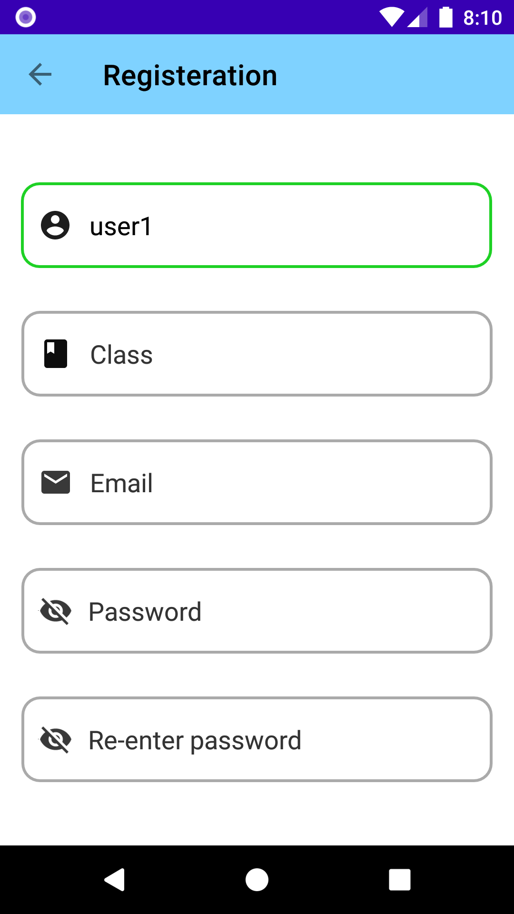
## home page
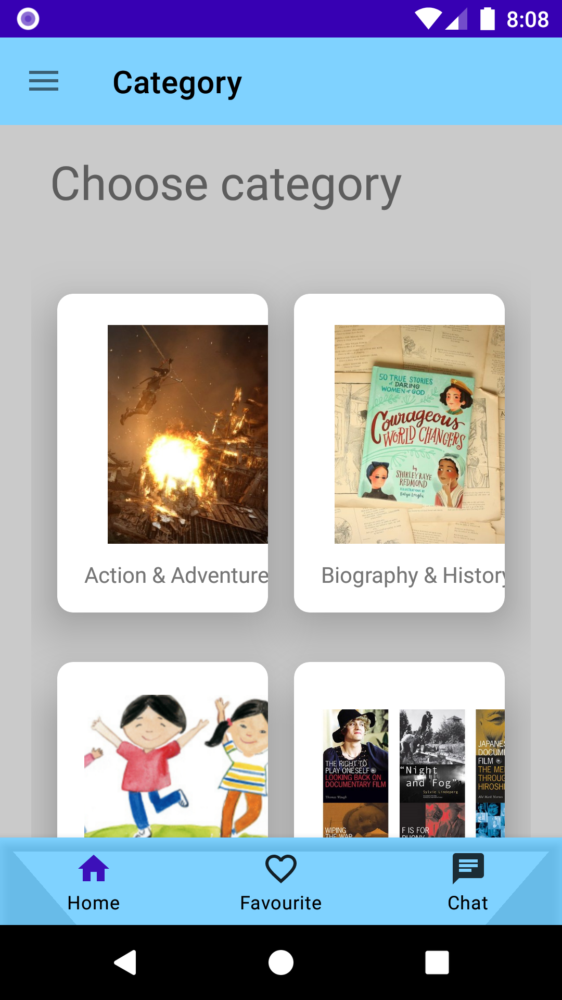
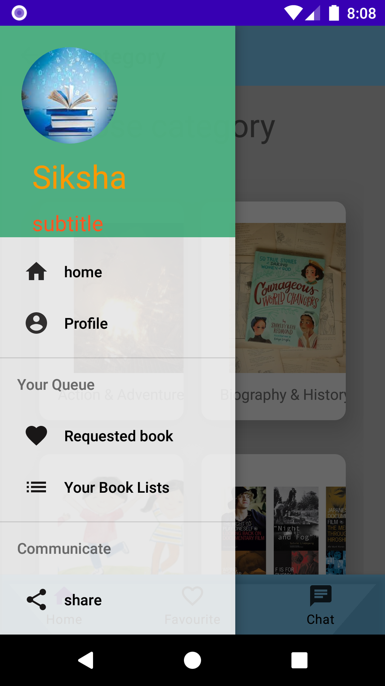
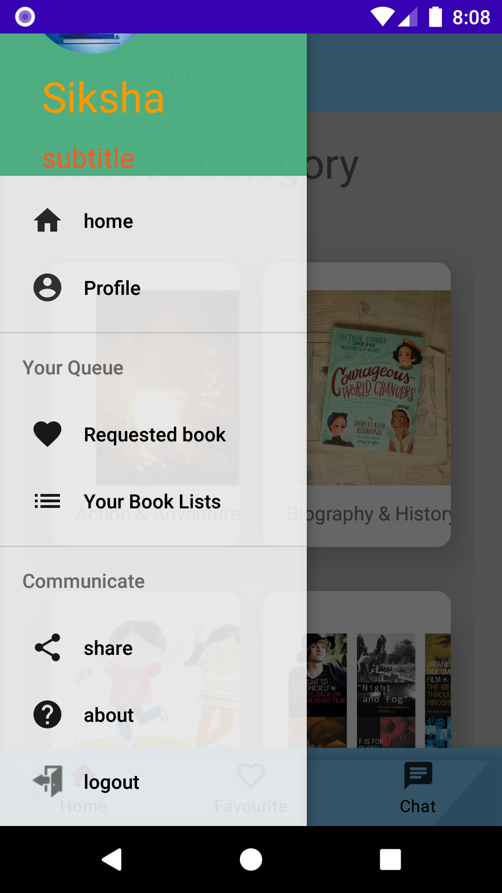
## Login page
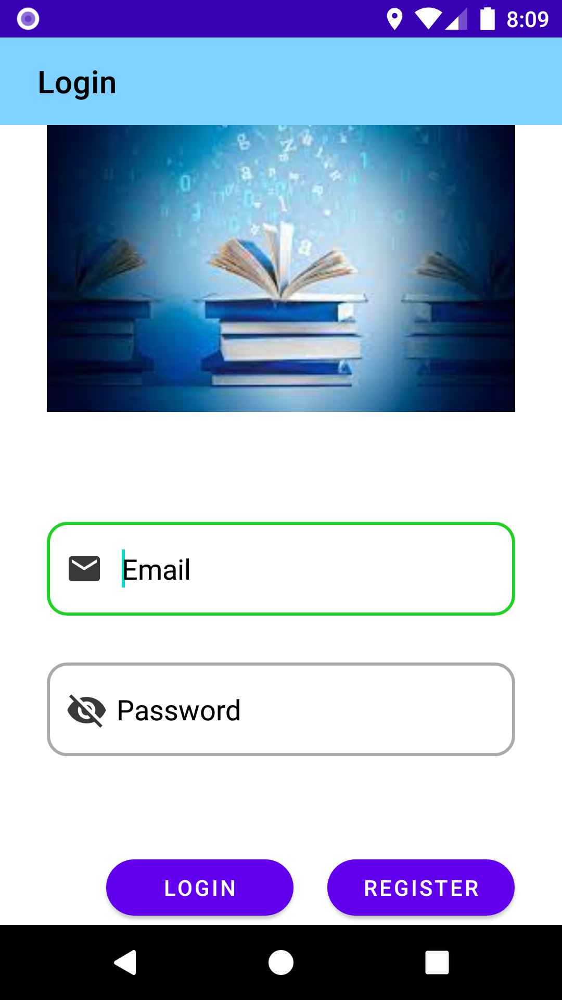
## books
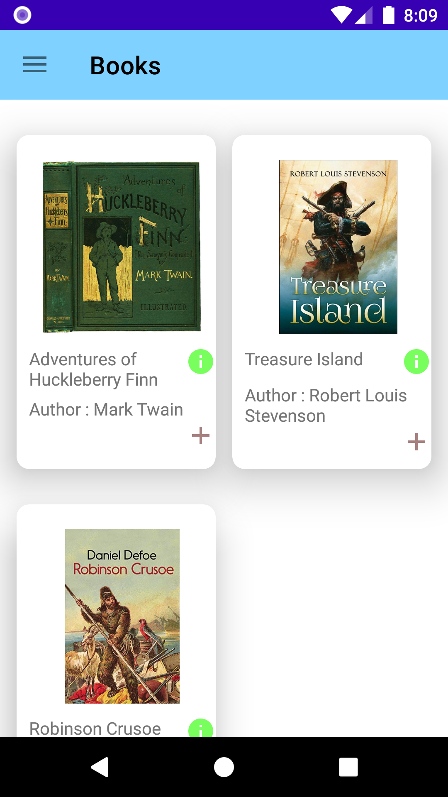
## screen for message transfer btw registered users
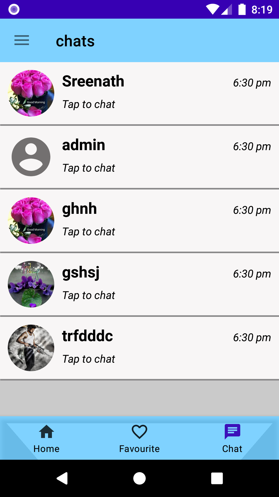

# ScreenShots of admin swing 
## Login
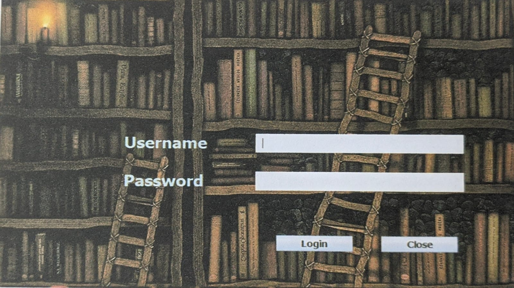
## Home

## Add new reader 
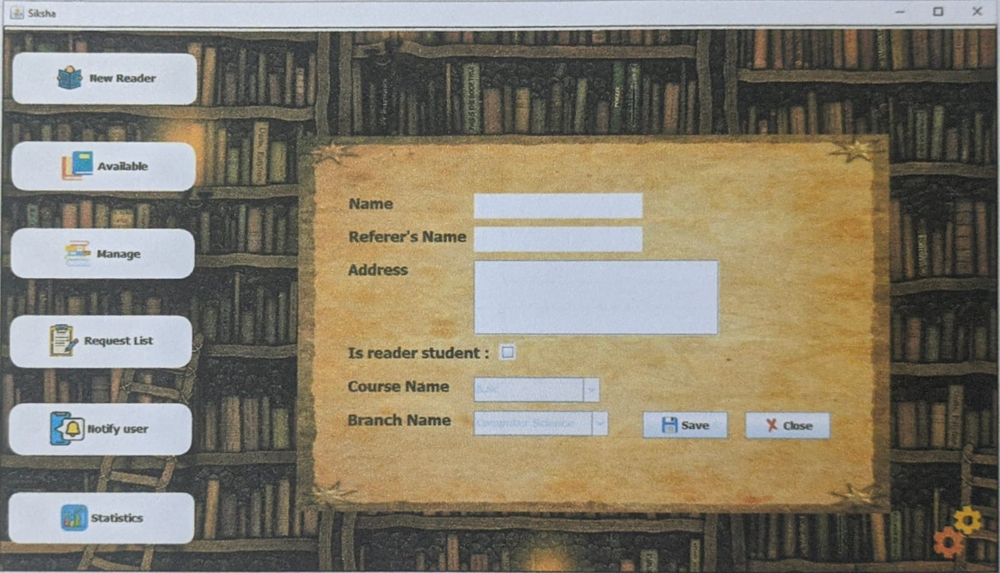
## Listing all books 
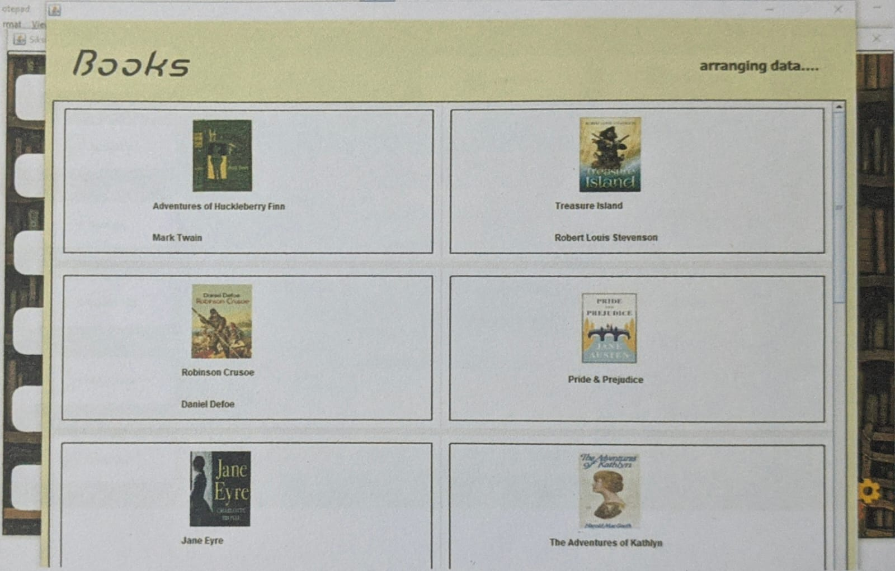
## Managing books 
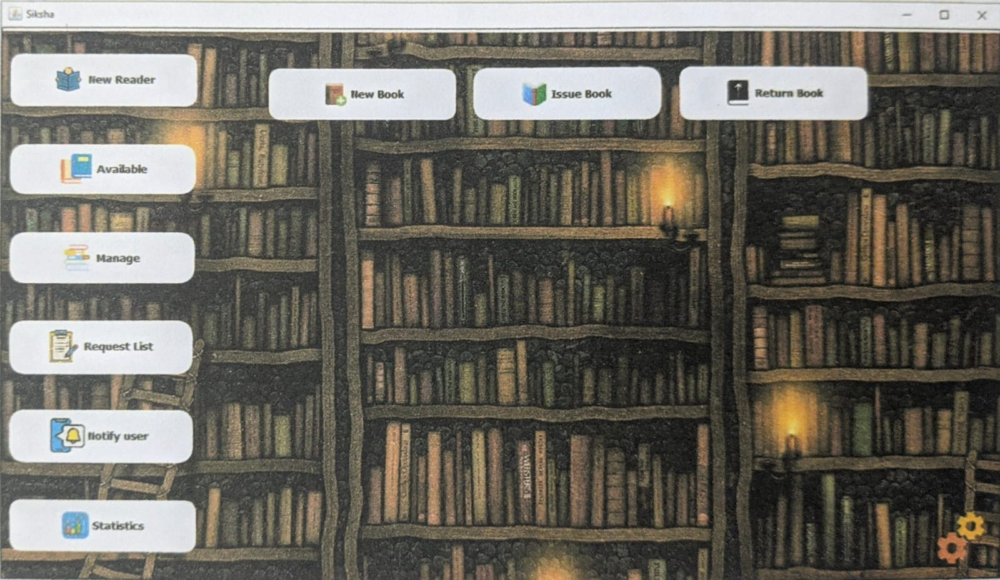
## Adding new books 
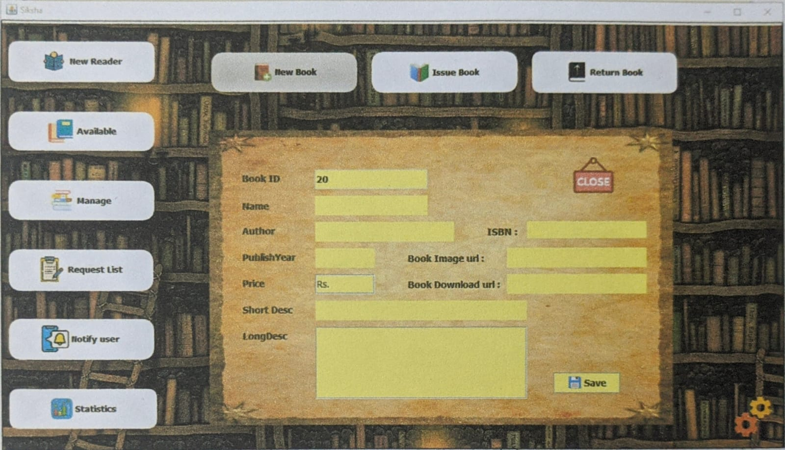
## Issuing books 
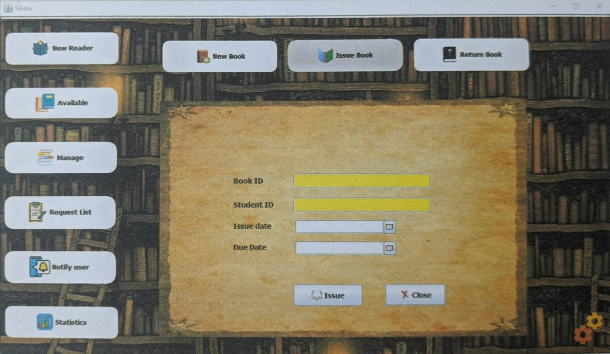
## Issue books details 
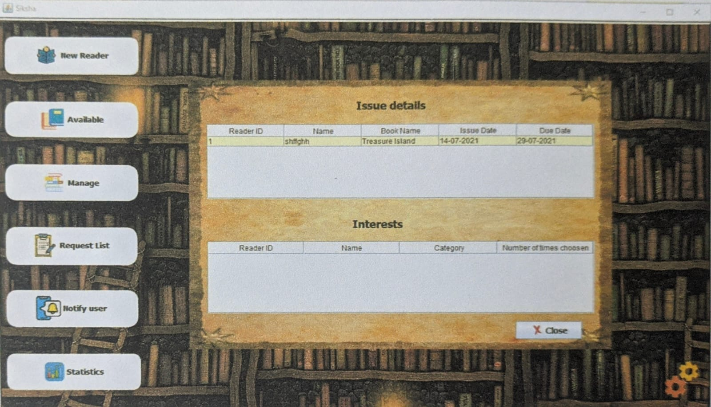
## Book request 
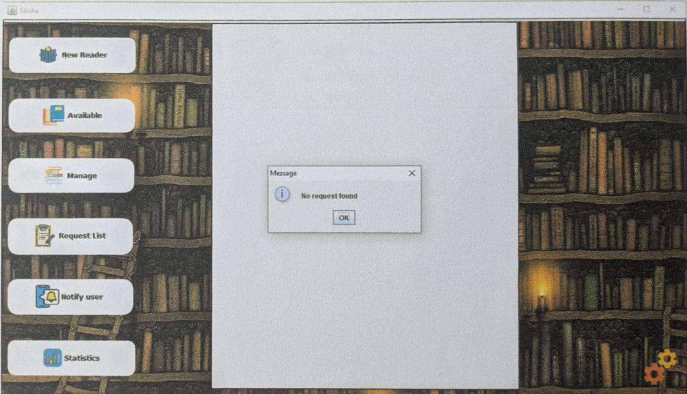
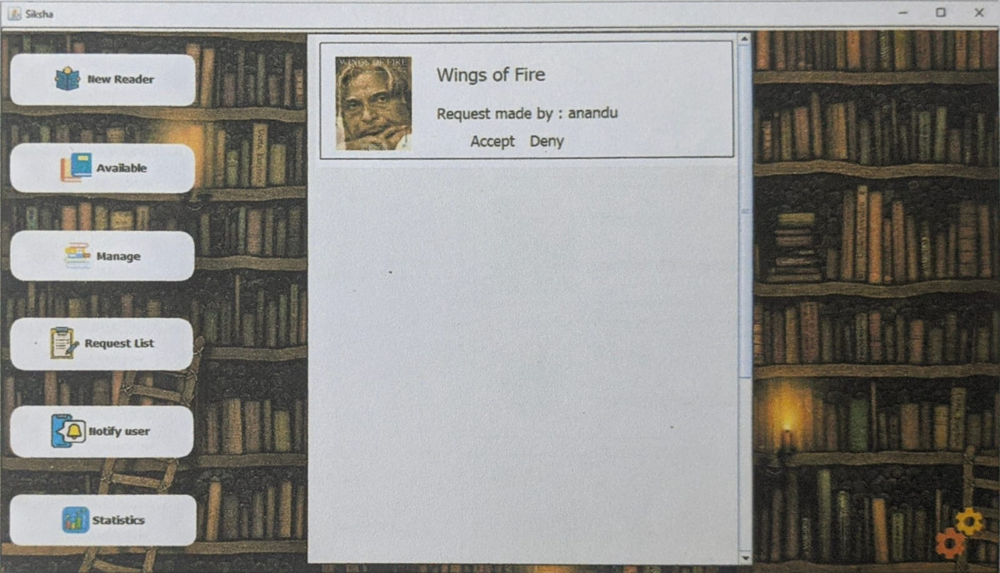
## Issue books details 

## sending messages to user
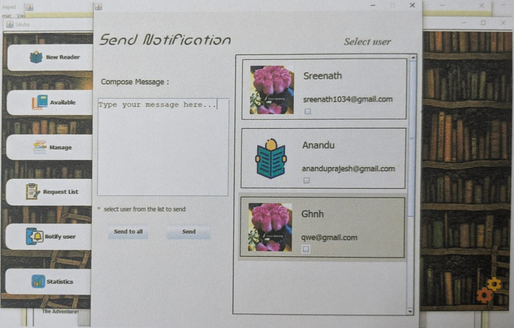
